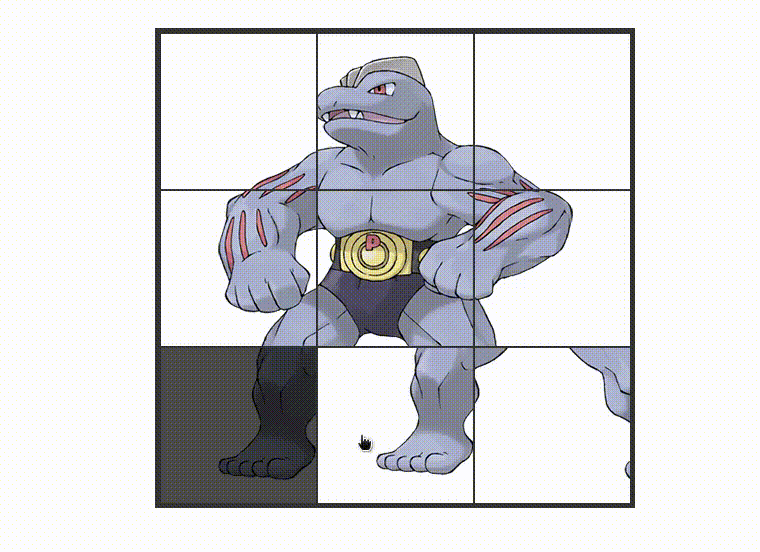

# Slide Puzzle

this is simple slide puzzle build built using images from a free [pokemon api](https://pokeapi.co/). if you want to try click on the live link bellow.



## Built With

- Webpack
- HTML
- CSS
- JAVASCRIPT

## Live Link

[Demo Link](https://js-slide-puzzle.netlify.app/)

## Usage

start by cloning this repository by running:

```
git clone https://github.com/rachidelaid/slide-puzzle.git
```

cd to the folder

```
cd slide-puzzle
```

run this command to install all the packages needed

```
npm install
```

to run a live server on port 8080 run this command

```
npm run start
```

to build your project run:

```
npm run build
```

## Authors

👤 **Rachid El aid**

- GitHub: [@rachidelaid](https://github.com/rachidelaid)
- Twitter: [@rachidelaid1](https://twitter.com/rachidelaid1)
- LinkedIn: [rachid elaid](https://www.linkedin.com/in/rachid-elaid-106336203/)

## Show your support

Give a ⭐️ if you like this project!
